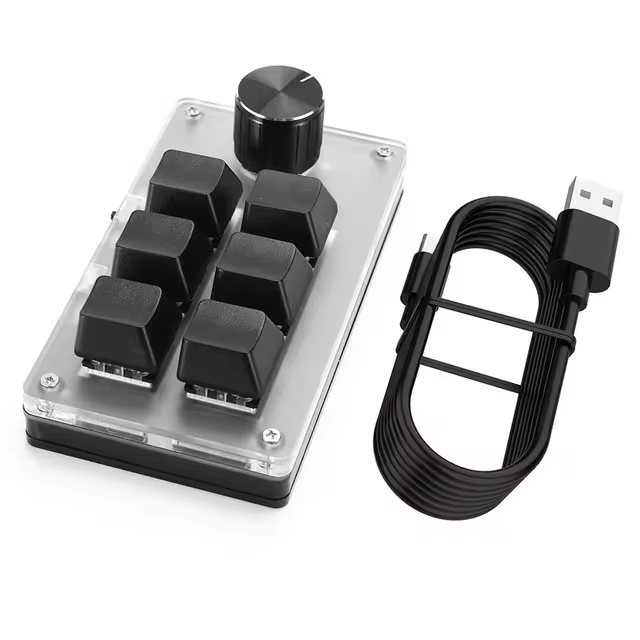
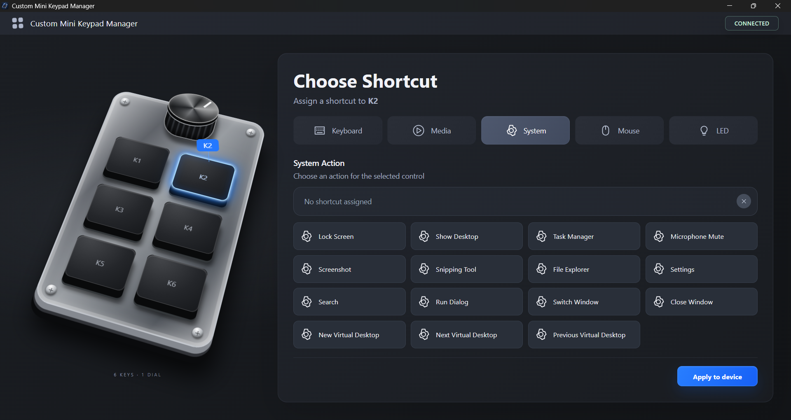

# Custom Mini Keypad Manager

Desktop app for configuring shortcuts, media actions, mouse actions, and LED modes for a custom mini keypad with 6 keys and 1 rotary dial.



## Overview

Custom Mini Keypad Manager is a React + Tauri app for editing a local keypad profile and applying supported assignments to the physical device over USB HID.

The UI lets you select each key or dial action, assign a command, store the profile locally, and write supported changes to the keypad with **Apply to device**.

## Preview



## Hardware

The app targets compatible HID mini keypads with the following USB identifiers:

- USB VID: `0x1189`
- USB PID: `0x8890`
- Configuration interface: HID interface `mi_01`

The device exposes multiple HID interfaces:

- Interface 0: keyboard output
- Interface 1: vendor-specific configuration
- Interface 2: consumer/media output
- Interface 3: mouse output

The Tauri backend talks to the vendor-specific configuration interface. After a setting is applied, the keypad emits normal keyboard, media, or mouse events through its standard HID interfaces.

## Supported Sync

Currently supported:

- Keyboard shortcuts using normal keys plus `Ctrl`, `Shift`, `Alt`, and `Win`
- Media actions: volume up/down, mute, play/pause, next track, previous track
- Mouse actions: left/right/middle click and scroll up/down
- LED modes: `Mode 0`, `Mode 1`, and `Mode 2`

## How Sync Works

The frontend is React. Hardware access lives in the Rust/Tauri backend.

When **Apply to device** is clicked:

1. React sends the selected control and assignment to a Tauri command.
2. Rust opens the HID configuration interface.
3. Rust negotiates the report id by trying `3`, `0`, then `2`.
4. Rust writes the assignment payload.
5. Rust sends a commit command so the keypad stores the change.

## Project Structure

```text
src/
  components/       React UI
  data/             UI action and keyboard data
  hooks/            UI state hooks
  services/         Tauri invoke wrappers
  styles/           CSS

src-tauri/src/
  commands.rs       Tauri commands exposed to React
  device.rs         HID detection, opening, report negotiation, writes
  protocol.rs       Keypad protocol payload builders
```

## Requirements

- Node.js and npm
- Rust toolchain
- Tauri desktop prerequisites for your operating system
- A compatible HID mini keypad

For Tauri setup details, see the official Tauri prerequisites guide:
https://tauri.app/start/prerequisites/

## Getting Started

Install dependencies:

```powershell
npm install
```

Run the desktop app during development:

```powershell
npm run tauri:dev
```

Build the frontend:

```powershell
npm run build
```

Build the desktop bundle:

```powershell
npm run tauri:build
```

Run checks:

```powershell
npm run lint
cd src-tauri
cargo check
```
